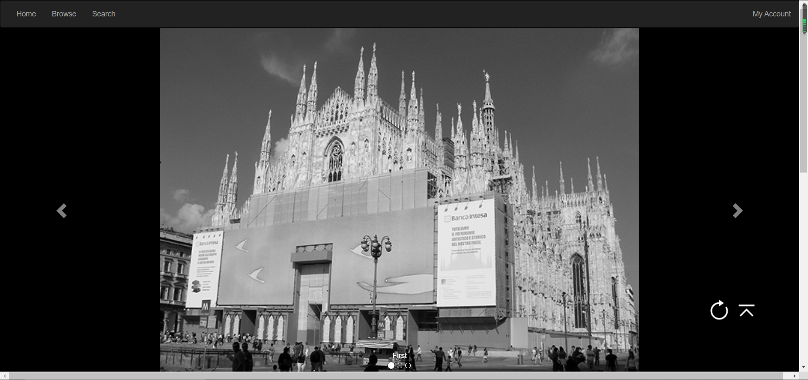
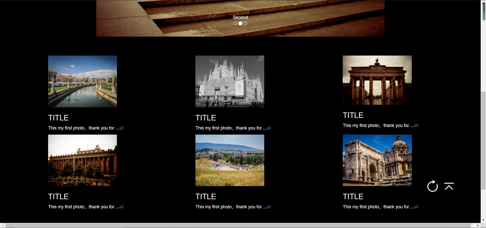
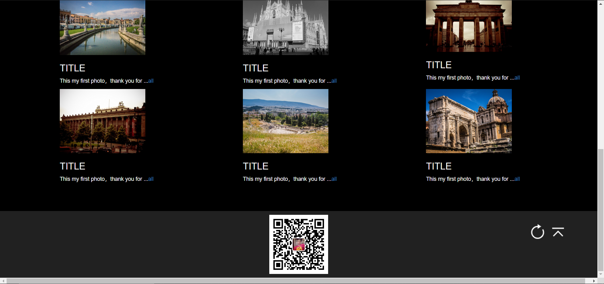

LAB 4 设计文档
   ==========       
   19302010060-牛嘉阳
 ### 布局结构：
     整体主要是通过bootstrap框架来布局的
       引入bootstrap文件
     1.导航栏
       向 <nav> 标签添加 class .navbar、.navbar-inverse。（反色导航栏，黑白）；
       向导航栏添添加带有 class .nav、.navbar-nav 的无序列表。
     2.下拉菜单
       通过navbar-right使My account处于页面右侧；
       引用dropdown类，向My account添加 data-toggle="dropdown" 来显示下拉菜单。
     3.图片轮播
       利用carousel插件；
       carousel-inner 类添加图片；   
       carousel-caption 类添加标题； 
       添加两个转换图片的图标（bootstrap自带）；
       设置图片大小一致，通过text-align使其居中 。         
     4.略缩图      
       通过row类，将三张图片置于一行；
     5.底部
       添加了二维码信息。
     6.刷新与回到顶部按钮
       bootstrap的自带图标。。。。。。
       最后复制粘贴了自己的。
     7.不可避免的使用了自己的css...
  ### 网页截图 ：    
   
   
   